# Inningsly — Architecture & Design

> Technical design reference. For feature requirements see `REQUIREMENTS.md`. For developer setup see `CLAUDE.md`.

---

## Table of Contents

1. [System Overview](#1-system-overview)
2. [Layer Architecture](#2-layer-architecture)
3. [Data Flow](#3-data-flow)
4. [Match State Machine](#4-match-state-machine)
5. [Innings State Machine](#5-innings-state-machine)
6. [Scoring Engine Internals](#6-scoring-engine-internals)
7. [Data Models (ERD)](#7-data-models-erd)
8. [Database Schema (SQLite)](#8-database-schema-sqlite)
9. [Cloud Architecture (Supabase)](#9-cloud-architecture-supabase)
10. [Live Match Broadcast Flow](#10-live-match-broadcast-flow)
11. [Delegate Code Flow](#11-delegate-code-flow)
12. [Navigation Structure](#12-navigation-structure)
13. [Platform Resolution](#13-platform-resolution)
14. [Store Dependency Map](#14-store-dependency-map)

---

## 1. System Overview

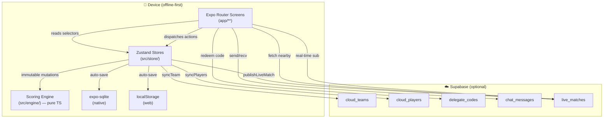

**Key invariants:**
- UI never calls repos directly — always via Zustand stores
- Engine is stateless/immutable — every method returns a new instance
- Cloud is optional — `isCloudEnabled` guards every Supabase call
- SQLite and localStorage are fully interchangeable (same repo interface, different implementations)

---

## 2. Layer Architecture

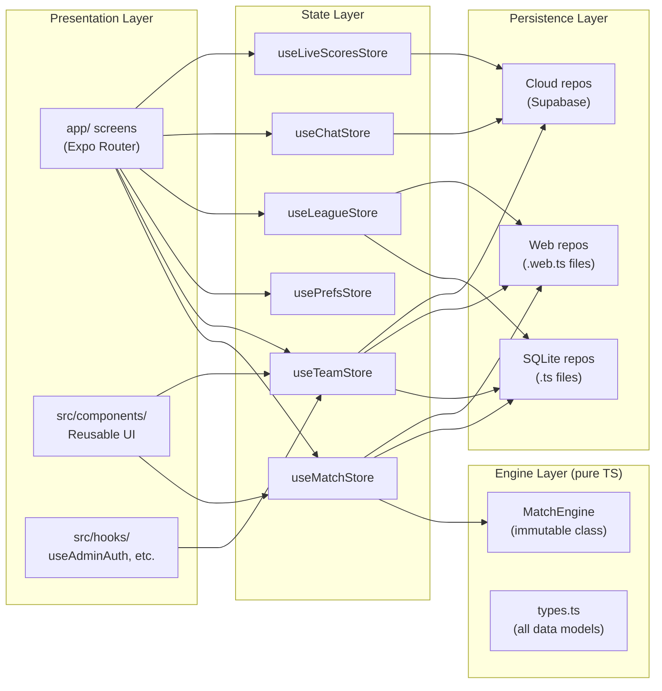

---

## 3. Data Flow

### Ball Recording (critical path)

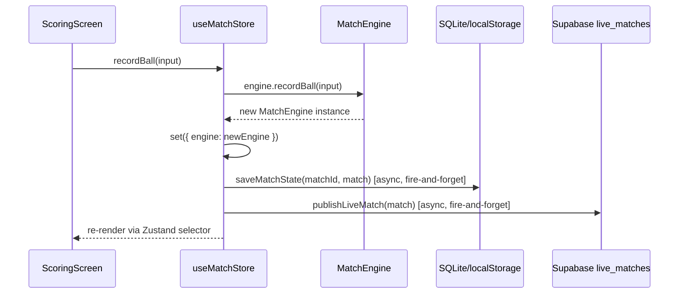

### Undo

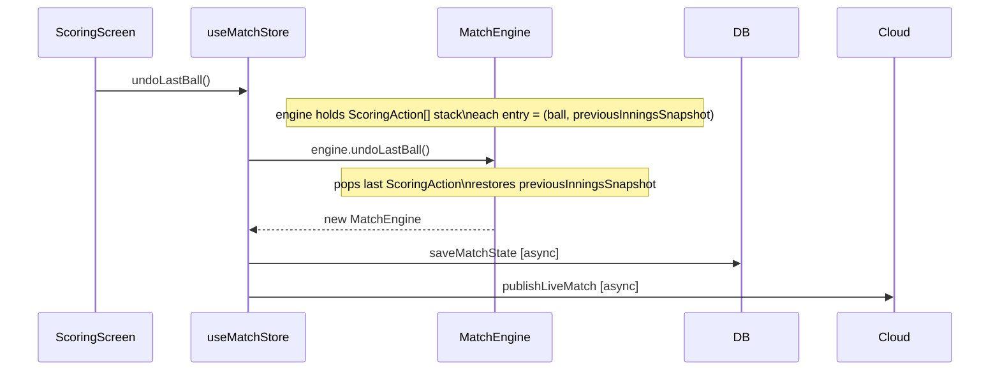

---

## 4. Match State Machine

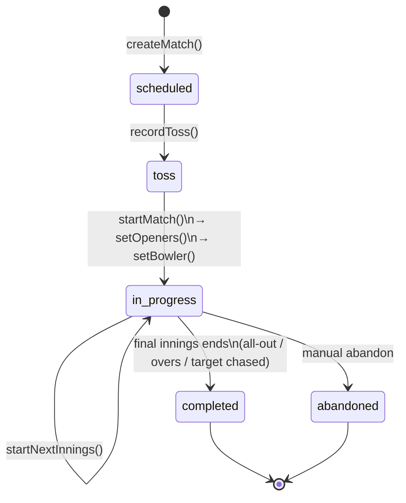

---

## 5. Innings State Machine

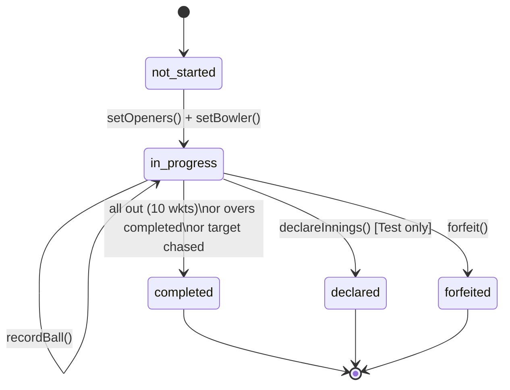

---

## 6. Scoring Engine Internals

### `recordBall()` processing pipeline

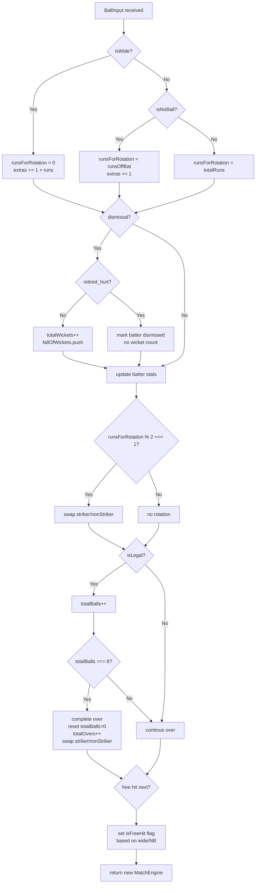

### Strike rotation rules

| Delivery | `runsForRotation` | Odd → swap? | End-of-over swap? |
|---|---|---|---|
| Legal, 1 run | 1 | ✓ | ✓ (net: back to striker) |
| Legal, 2 runs | 2 | ✗ | ✓ |
| Wide, 1 run | 0 | ✗ | ✓ |
| No Ball, 1 run off bat | 1 (off bat only) | ✓ | ✓ |
| No Ball, 0 runs | 0 | ✗ | ✓ |

---

## 7. Data Models (ERD)

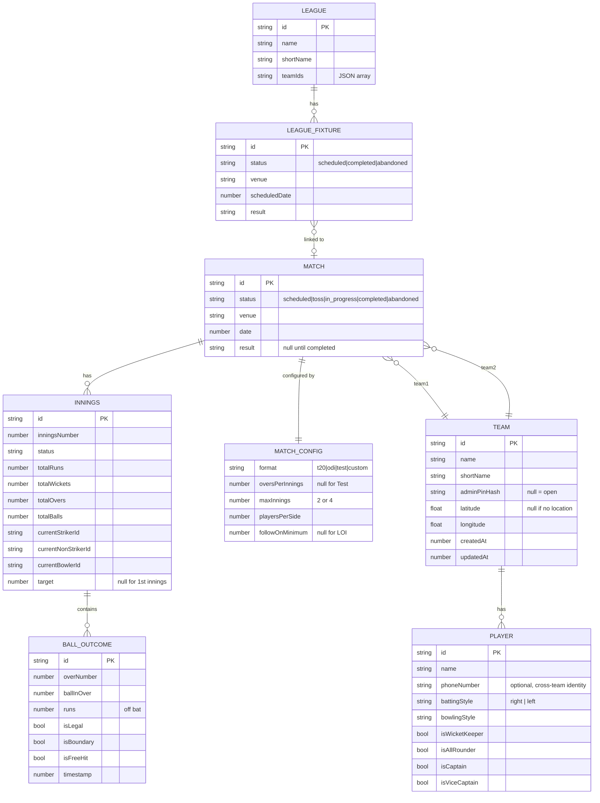

---

## 8. Database Schema (SQLite)

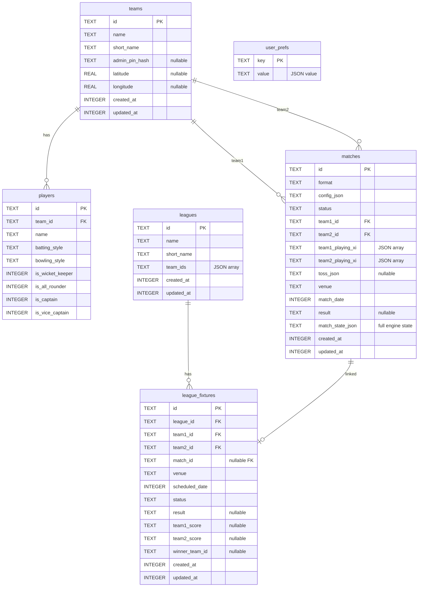

**Migration rules:**
- New columns: `ALTER TABLE ... ADD COLUMN` wrapped in try/catch
- **Never** add `NOT NULL` constraint in a migration (breaks Android SQLite < 3.37)
- PRAGMAs must be separate `execAsync` calls (Android SQLite limitation)

---

## 9. Cloud Architecture (Supabase)

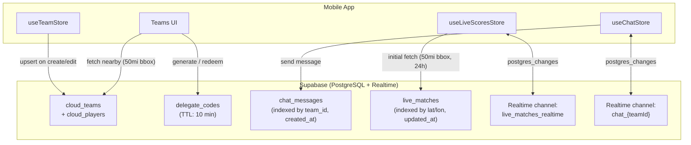

**Row Level Security:** All tables use `USING (true)` policies (anonymous read/write) — suitable for public community data. No user auth on the Supabase level; admin PIN auth is client-side only.

**Key validation (`src/config/supabase.ts`):**
- Legacy JWT key: `length > 100`
- New publishable key: starts with `sb_publishable_`
- `isCloudEnabled = isValidUrl && isValidKey`

---

## 10. Live Match Broadcast Flow

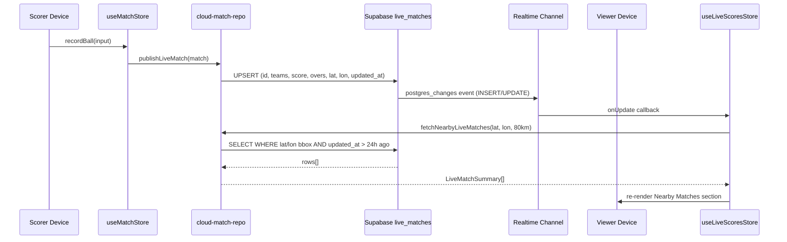

**Proximity query** (bounding box, not exact Haversine — fast, approximate):
```
latDelta = 80 / 111.0
lonDelta = 80 / (111.0 × cos(lat × π/180))
WHERE latitude BETWEEN (lat - latDelta) AND (lat + latDelta)
  AND longitude BETWEEN (lon - lonDelta) AND (lon + lonDelta)
  AND updated_at > (now - 24h)
ORDER BY updated_at DESC LIMIT 20
```

**Graceful degradation:** `PGRST205` (table not found) is silently ignored — live scores just won't show until the SQL is run in Supabase.

---

## 11. Delegate Code Flow

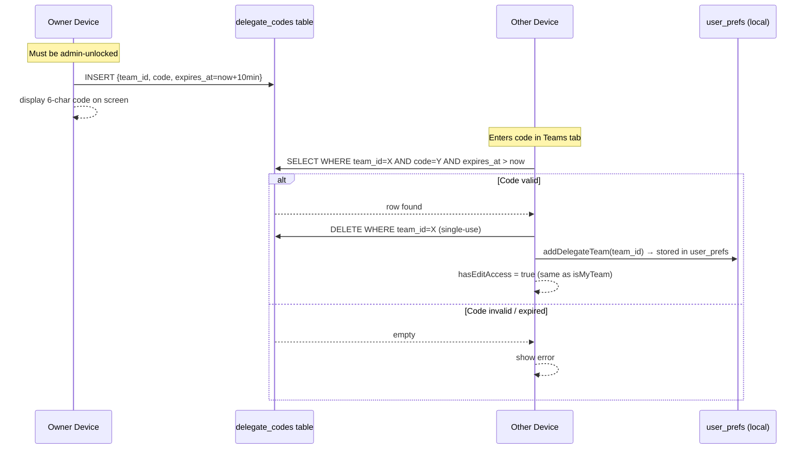

---

## 12. Navigation Structure

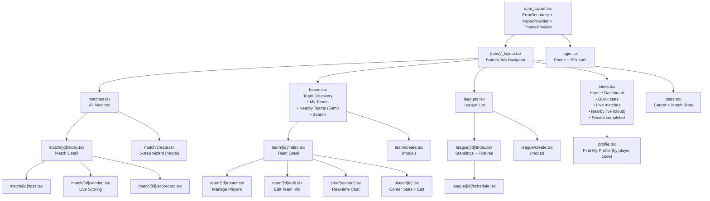

---

## 13. Platform Resolution

Metro bundler resolves `.web.ts` before `.ts` for browser builds. This allows a clean SQLite ↔ localStorage swap with zero UI changes.

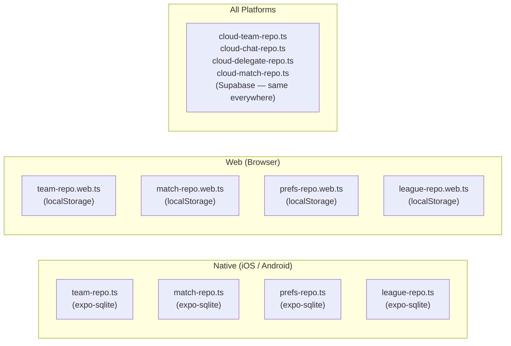

Both repo variants implement the same TypeScript interface, so stores are platform-agnostic.

---

## 14. Store Dependency Map

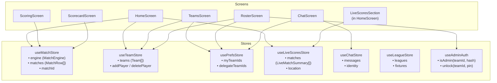
